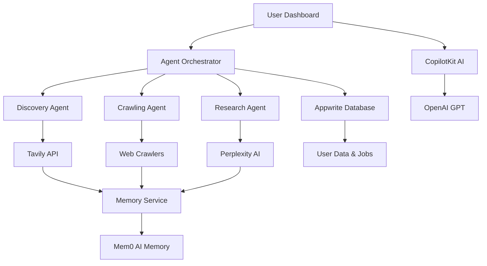

# AgentHub - Multi-Agent Competitive Intelligence Platform

<div align="center">
    
  *Pushing the Limits of Agentic AI in Competitive Intelligence*
  
  [](https://copilotkit.ai)
  [](https://appwrite.io)
  [](https://tavily.com)
  [](https://mem0.ai)

</div>

---

## 🚀 About AgentHub

**AgentHub** is an advanced multi-agent competitive intelligence platform that demonstrates the cutting edge of agentic AI. Built specifically for the [100 Agents Hackathon](https://100agents.devpost.com/), this project showcases how multiple AI agents can work together autonomously to solve complex business intelligence challenges.

Our platform combines **autonomous AI agents**, **advanced crawling technology**, **memory-powered learning**, and **intelligent research capabilities** to deliver real-time competitive insights that drive strategic business decisions.

## 🤖 Multi-Agent Architecture

AgentHub features a sophisticated orchestrated agent system:

### 🔍 **Discovery Agent**
- **Autonomous competitor discovery** using industry analysis
- **Smart market research** with relevance scoring  
- **Source identification** across news, blogs, and directories
- **Anti-detection crawling** for reliable data gathering

### 🕷️ **Crawling Agent** 
- **Distributed web crawling** with intelligent scheduling
- **Real-time change detection** and monitoring
- **Content classification** and priority scoring
- **Anti-bot evasion** for continuous data collection

### 🧠 **Research Agent**
- **Deep research** using Tavily and Perplexity APIs
- **Multi-source intelligence gathering** from academic, news, and industry sources
- **Competitive analysis** with SWOT insights
- **Trend detection** and forecasting
- **Source credibility assessment** for reliable insights

### 🧩 **Agent Orchestrator**
- **Intelligent task routing** between agents
- **Real-time communication** and data sharing
- **Resource optimization** and load balancing  
- **Error handling** and recovery mechanisms

### 💾 **Memory Service** (Mem0 Integration)
- **Long-term memory** for user preferences and insights
- **Contextual learning** that improves over time
- **Research history** and pattern recognition
- **Personalized recommendations** based on past behavior

## ✨ Key Features

### 🎯 **Autonomous Intelligence**
- **24/7 competitor monitoring** with automated alerts
- **Real-time market analysis** and trend identification
- **Strategic recommendations** based on competitive data
- **Predictive insights** for market opportunities

### 🔬 **Advanced Research Capabilities**
- **Multi-modal research** across text, social media, and news
- **Academic source integration** for credible insights
- **Sentiment analysis** and impact assessment
- **Historical trend analysis** with forecasting

### 🧠 **Memory-Powered Learning**
- **Adaptive intelligence** that learns user preferences
- **Contextual understanding** of business domain
- **Continuous improvement** through interaction feedback
- **Personalized insight generation**

### 💬 **AI-Enhanced User Experience**
- **CopilotKit AI assistant** with competitive intelligence expertise
- **Smart text completion** for research queries
- **Custom AI actions** for competitor analysis
- **Contextual help** throughout the platform

## 🛠 Technology Stack

### **Core Framework**
- **Next.js 14** - Modern React framework with App Router
- **TypeScript** - Type-safe development
- **Tailwind CSS** - Responsive UI design

### **AI & Agents**
- **CopilotKit** - AI copilot integration and runtime
- **Tavily API** - Advanced web crawling and research
- **Perplexity AI** - Deep analysis and insights generation
- **Mem0** - AI memory and learning layer

### **Backend & Data**
- **Appwrite** - Authentication, database, and serverless functions
- **Node Appwrite** - Server-side integrations
- **Custom Agent Orchestration** - Multi-agent coordination system

### **Research & Analysis**
- **Serper API** - Search and discovery enhancement
- **Keywords AI** - LLM monitoring and optimization
- **Custom sentiment analysis** - Market intelligence processing

## 🚀 Quick Start

### Prerequisites
```bash
# Required API Keys (get from respective providers)
APPWRITE_API_KEY=your_appwrite_api_key
TAVILY_API_KEY=your_tavily_api_key  
PERPLEXITY_API_KEY=your_perplexity_api_key
MEM0_API_KEY=your_mem0_api_key
OPENAI_API_KEY=your_openai_api_key
NEXT_PUBLIC_COPILOTKIT_PUBLIC_API_KEY=your_copilotkit_api_key
```

### Installation & Setup
```bash
# Clone the repository
git clone <repository-url>
cd agenthub

# Install dependencies
npm install

# Configure environment
cp env.example .env
# Edit .env with your actual API keys

# Set up database
npm run setup-db

# Start development server
npm run dev
```

### 🔒 Security Note
- All API keys are stored securely in environment variables
- The `.env` file is excluded from version control
- Never commit real API keys to the repository

## 📊 Agent System Demo

### 1. **Discovery Agent in Action**
```javascript
// Autonomous competitor discovery
const discovery = await agentManager.discoverCompetitors('SaaS productivity tools');
// Returns: ranked competitors with relevance scores, descriptions, and similarity reasons
```

### 2. **Research Agent Intelligence**
```javascript  
// Deep competitive analysis
const research = await agentManager.performResearch(
  'Notion vs Airtable competitive analysis',
  { 
    type: 'competitive_analysis',
    depth: 'comprehensive',
    sources: 'all'
  }
);
// Returns: detailed insights, trends, recommendations, and strategic intelligence
```

### 3. **Memory-Powered Learning**
```javascript
// Contextual memory storage
await memoryService.storeResearchFindings(findings, {
  userId: 'user123',
  industry: 'SaaS',
  researchType: 'competitive_analysis'
});
// AI learns user preferences and improves recommendations
```

## 🎯 Business Impact

### **Real-World Applications**
- **Strategic Planning** - Data-driven competitive positioning
- **Market Research** - Automated industry analysis and trends
- **Product Development** - Feature gap analysis and opportunities
- **Sales Intelligence** - Competitive battlecards and positioning
- **Investment Research** - Market due diligence and competitor assessment

### **ROI Demonstration**
- **Cost Reduction**: $50,000/year consultant → $500/month SaaS
- **Time Savings**: Weeks of manual research → Real-time insights
- **Competitive Advantage**: 2-week head start on market developments
- **Scalability**: Monitor 100+ competitors vs. manual tracking of 5-10

## 🏗 System Architecture



## 📝 API Documentation

### **Agent Management API**
```typescript
// Initialize agent system
await agentManager.initialize();

// Execute discovery task
const result = await agentManager.discoverCompetitors(
  'industry', 
  ['keyword1', 'keyword2']
);

// Monitor competitor changes
await agentManager.monitorChanges(
  ['domain1.com', 'domain2.com'], 
  'daily'
);
```

### **Research API**
```typescript
// Deep research with context
const research = await agentManager.performResearch(query, {
  type: 'market_intelligence',
  context: {
    industry: 'SaaS',
    competitors: ['competitor1', 'competitor2'],
    timeframe: 'recent',
    depth: 'comprehensive'
  }
});
```

## 🔄 Development Workflow

### **Agent Development**
1. **Create Agent Class** - Extend BaseAgent with specific capabilities
2. **Register with Orchestrator** - Add to agent management system  
3. **Define Task Types** - Specify supported operations
4. **Implement Execution Logic** - Core agent functionality
5. **Add Memory Integration** - Connect with Mem0 for learning

### **CopilotKit Integration**
1. **Custom Actions** - Domain-specific AI functions
2. **Context Sharing** - Real-time data integration
3. **User Experience** - Seamless AI assistance
4. **Error Handling** - Robust production deployment
